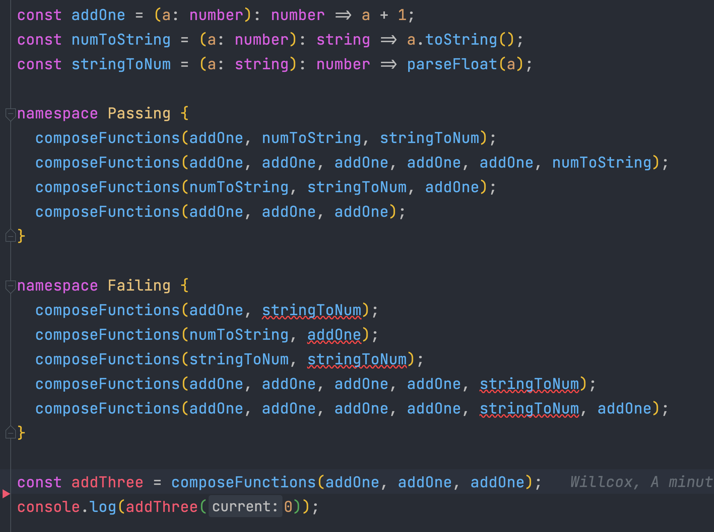
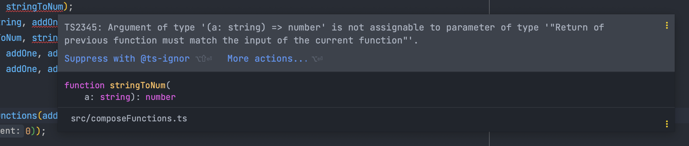

# TypeScript Fuckery
###### _The side of typescript they dont want you to know about_

***

### [composeFunctions](./src/composeFunctions.ts)
_Quickly create a new function by chaining other valid functions together, offers real time errors and even shows you the function causing the error._

_Also allows you to pass in any number of functions as it checks the types recursively_

  
Show image preview

***

